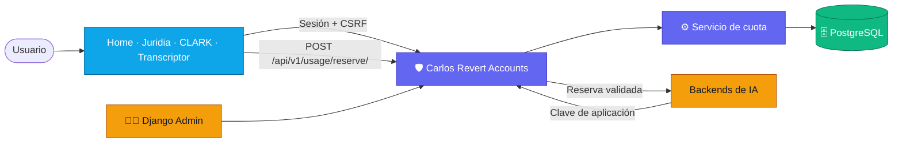
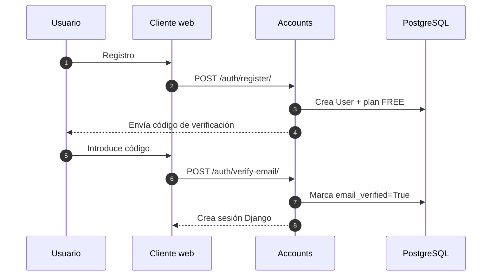
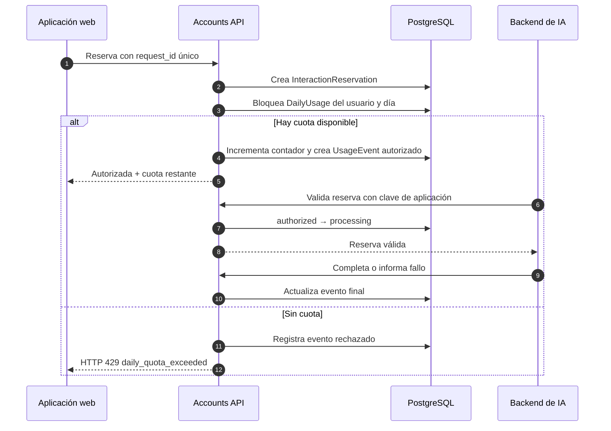
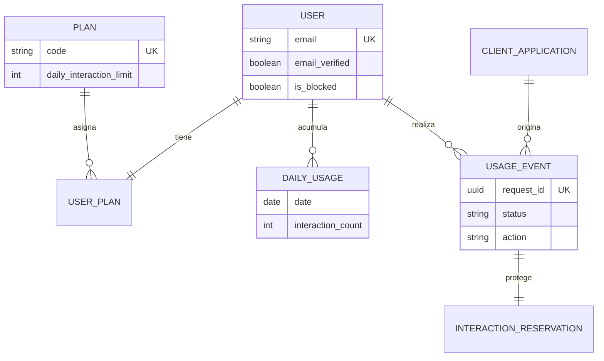
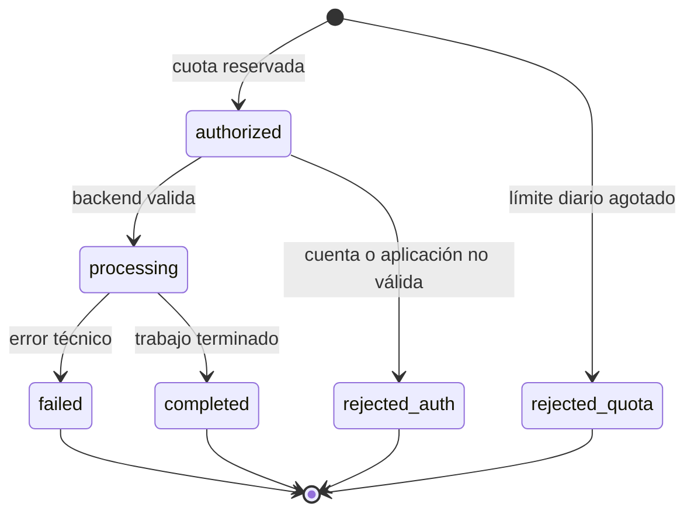

# Arquitectura de Carlos Revert Accounts

> **Una cuenta, una sesión y una cuota compartida** para Home, Juridia, CLARK y Transcriptor.

| Papel | Tecnología | Responsabilidad |
| :-- | :-- | :-- |
| **Servicio central** | Django 5 + Django REST Framework | Identidad, sesiones, planes y consumo |
| **Persistencia** | PostgreSQL | Usuarios, planes, reservas y auditoría |
| **Clientes** | Aplicaciones web y backends de IA | Solicitan sesión y consumen reservas validadas |
| **Operación** | Docker + Django Admin | Despliegue, administración y métricas |

---

## Mapa rápido



El repositorio **no procesa las respuestas de IA**. Es la autoridad común que decide quién puede usar los productos, con qué plan y cuántas interacciones puede realizar.

---

## Las cuatro capas

```text
┌─────────────────────────────────────────────────────────────┐
│  1. PRESENTACIÓN                                              │
│  Páginas Django, formularios, sesión y panel Mi cuenta        │
├─────────────────────────────────────────────────────────────┤
│  2. API V1                                                    │
│  Registro, login, perfil, reserva, historial y métricas       │
├─────────────────────────────────────────────────────────────┤
│  3. DOMINIO                                                    │
│  Planes, cuota compartida, idempotencia y ciclo de eventos    │
├─────────────────────────────────────────────────────────────┤
│  4. INFRAESTRUCTURA                                            │
│  PostgreSQL, caché de límites, Docker y configuración         │
└─────────────────────────────────────────────────────────────┘
```

| Capa | Dónde leerla | Idea clave |
| :-- | :-- | :-- |
| Rutas | [`config/urls.py`](config/urls.py) | Separa la web, `/api/v1/`, salud y OpenAPI. |
| API | [`apps/api/`](apps/api/) | Expone el contrato consumido por web y servicios internos. |
| Dominio | [`apps/usage/services/quota_service.py`](apps/usage/services/quota_service.py) | Protege el contador frente a reintentos y concurrencia. |
| Datos | [`apps/*/models.py`](apps/) | Modela usuarios, planes, aplicaciones y auditoría. |
| Pruebas | [`tests/`](tests/) | Verifica permisos, cuota, correo y endurecimiento de producción. |

---

## Flujo 1 · Crear y usar una cuenta



La sesión se comparte bajo los subdominios autorizados. Por ello, una misma cuenta puede entrar en los distintos productos sin crear identidades duplicadas.

---

## Flujo 2 · Consumir una interacción de IA



### Por qué este flujo es robusto

- **Transaccional:** `transaction.atomic()` agrupa cada reserva para que no exista un incremento a medias.
- **Seguro ante concurrencia:** `select_for_update()` bloquea el contador diario mientras se actualiza.
- **Idempotente:** repetir el mismo `request_id` devuelve la reserva original; no cobra dos veces.
- **Trazable:** cada intento genera un `UsageEvent`, incluido un rechazo por falta de cuota.
- **Aislado por aplicación:** el backend de Juridia no puede validar una reserva creada para CLARK.

---

## Modelo de datos



| Entidad | Responde a |
| :-- | :-- |
| `User` | ¿Quién es la persona y puede usar el servicio? |
| `Plan` / `UserPlan` | ¿Cuál es su límite diario? |
| `DailyUsage` | ¿Cuántas interacciones ha usado hoy? |
| `InteractionReservation` | ¿Este reintento ya se procesó? |
| `UsageEvent` | ¿Qué ocurrió durante el ciclo de la interacción? |
| `ClientApplication` | ¿Qué producto solicita la operación y tiene autorización interna? |

---

## Estados de una interacción



> Los errores configurados como previos al procesamiento pueden devolver una unidad de cuota. Los demás permanecen registrados como consumo porque el proveedor de IA ya pudo haber trabajado.

---

## Seguridad incorporada

| Protección | Aplicación práctica |
| :-- | :-- |
| Sesión segura | Cookies `Secure`, `HttpOnly` y CSRF para operaciones con sesión. |
| Verificación de correo | Código de un solo uso, caducidad y límites de reenvío/intentos. |
| Antifraude | Rate limiting por IP e identificador; solo se confía en proxies declarados. |
| Servicios internos | Cabeceras de aplicación + clave guardada como hash. |
| Privacidad | Los metadatos eliminan prompts, respuestas y cuerpos sensibles. |
| Auditoría | Historial de planes, eventos de consumo y métricas agregadas. |

---

## Recorrido recomendado del código

1. [`README.md`](README.md): visión global y comandos de operación.
2. [`config/urls.py`](config/urls.py): todos los puntos de entrada.
3. [`apps/api/views.py`](apps/api/views.py): contrato HTTP y permisos por endpoint.
4. [`apps/usage/services/quota_service.py`](apps/usage/services/quota_service.py): núcleo de negocio.
5. [`apps/usage/models.py`](apps/usage/models.py): reserva, contador y auditoría.
6. [`tests/test_quota.py`](tests/test_quota.py) y [`tests/test_api_permissions.py`](tests/test_api_permissions.py): evidencia automatizada de los casos críticos.

---

## Idea final

**Accounts convierte varios productos de IA en una plataforma coherente:** una identidad verificable, planes configurables, cuota común y un registro fiable de cada operación.
