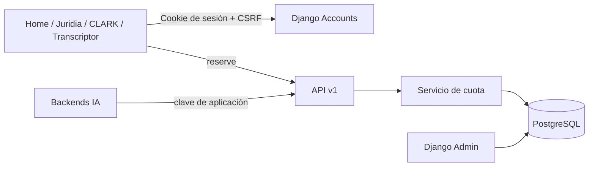

# Arquitectura

Los límites viven en `Plan`, no en código. `UserPlan` es uno a uno, `DailyUsage` es único por usuario y fecha y `UsageEvent` mantiene el historial. `InteractionReservation` se crea antes de cualquier incremento para hacer idempotente el `request_id` bajo concurrencia.
