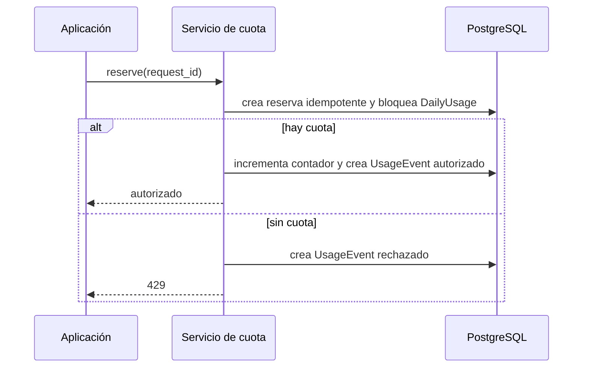

# Política de cuota

FREE dispone de 5 y PREMIUM de 20 interacciones por día local. El contador es único por usuario y día y suma todas las aplicaciones con `consumes_quota=True`. Una aplicación como Home puede estar registrada sin consumir.

Un fallo `before_processing` reembolsa una reserva porque se produjo antes de usar recursos del modelo. Otros fallos permanecen consumidos. La lista puede cambiarse con `QUOTA_REFUNDABLE_ERROR_CODES`.
